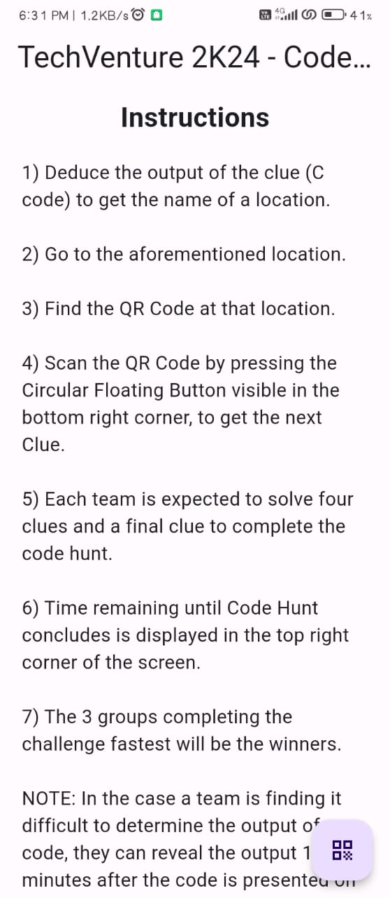
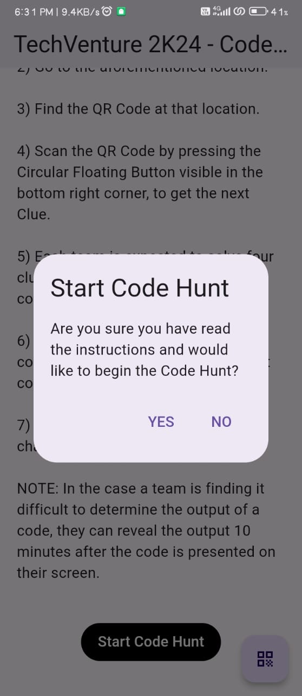
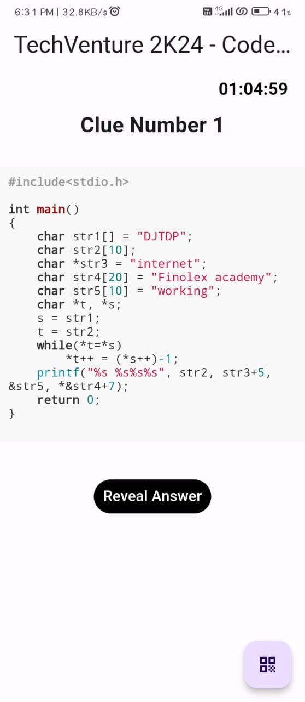
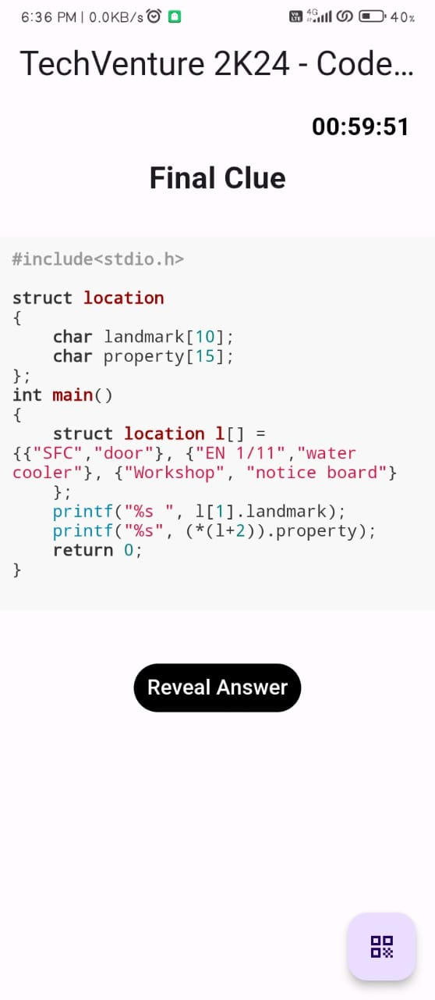

# TechVenture 2k24: Code Hunt
This repository contains the source code and instructions to setup and build the app used in the Code Hunt conducted as a part of the TechVenture 2K24 event conducted by Department of Computer Science Engineering (AI&ML) at Finolex Academy of Management and Technology, Ratnagiri

The idea of Code Hunt is similar to a treasure hunt. The participating teams are requested to install the code hunt app. Through this app each team is presented with C snippets. The output of the code points them to a location in the campus. Upon reaching the location they scan a QR code previously pasted in that location using the same app. If the team has reached the correct location, they are presented with the next clue (C snippet).

## Instructions of the Code Hunt
1. Deduce the output of the clue (C code) to get the name of a location
   
2. Go to the aforementioned location.
   
3. Find the QR Code at that location.
   
4. Scan the QR Code to get the next Clue.
   
5. To Scan a QR Code press the Circular Floating Button visible in the bottom right corner.
   
6. Each team is expected to solve four clues and a final clue to win the code hunt.
   
7. Time remaining until Code Hunt concludes is displayed in the top right corner of the screen.
   

> [!NOTE] 
> In the case a team is finding it difficult to determine the output of a code, they can reveal the output 10 minutes after the code is presented on their screen.

## Screenshots
Initial Screen     |  Start Code Hunt  |   First Clue      | Final Clue        | Completed         |
:-----------------:|:-----------------:|:-----------------:|:-----------------:|:-----------------:|
|||||

## Setup Instructions

- Identify and list at-least 15 locations throughout the campus.

- Choose a final location where the code hunt ends.

- Frame C snippets output of which leads to the location.

- #### Feeding clues in the app
	Clues are stored in the `clues.dart` file. Each clue has the following properties
	- `code`: The C snippet whose output is the name of the location.
	- `solution`: The output of the C snippet.
	- `cluster`: The group the location belongs to. This can be the name of the department, landmark, etc. It is recommended not to have more than 5 clusters.
	- `id`: This is the unique identification number to identify the location. This id will be stored in the QR code at that location. This should preferably be a long random number. Coordinators can use `randnum.py` to generate these ids.

  A location can have multiple clues pointing to it., just make sure they have the same `id`. However, there can be only one final clue pointing to the final location. Make sure to place the final clue at the end of the `clues` array in the `clues.dart` file. 
- #### Genrating QR Codes
	- To generate QR codes use the online tool: https://www.qr-code-generator.com/
	- Use the `id` used in `clues.dart` to generate QR codes for that location.

- The total time, time before the solution is revealed and the number of locations each team has to go through before being presented the final clue can be modified.

- Paste the QR codes at their respective locations.   
	

## Features of the Code Hunt app
- As soon as the participant / team clicks on the 'Start Code Hunt' button, the app makes a note of the time. This allows the app to keep track of the time even if the app crashes or the device is restarted.

- Since clues are selected at random from all the clues fed into the app, two teams getting the same path (set of locations) is highly unlikely (also depends on number of teams and total number of clues). But the final clue / location is common for all the participants.

- The app saves its state after a correct QR code is scanned or when the Code Hunt is completed.

- Each clue with its associated location requires the coordinators to also provide the name of the cluster the location belongs to. This can be the name of the department, a landmark the location is near to, etc. No two consecutive clues displayed in the app are from same cluster. This ensures all the location a participating team has to go through is distributed through out the campus / premises.

## TODO
- Add capability to have multiple final clues (C codes) for the same final location

- Add capability to have a validation code. That is the Code Hunt cannot start / end until a coordinator enters a secret code. 

- Add restriction on taking screenshot, closing the app in between, background activity, etc. to avoid any misconducts during the game.

- Add a central/remote server/database/controlling system which can monitor all participants and notify them about the leaderboard directly in app notifications.
 
 
 

# Inspired by-
Zohaib, my senior, who developed the first version of this app.

[@zohaib2002/CodeHunt](https://github.com/zohaib2002/CodeHunt)
---

# 😊 Happy Hunting ! 🎯